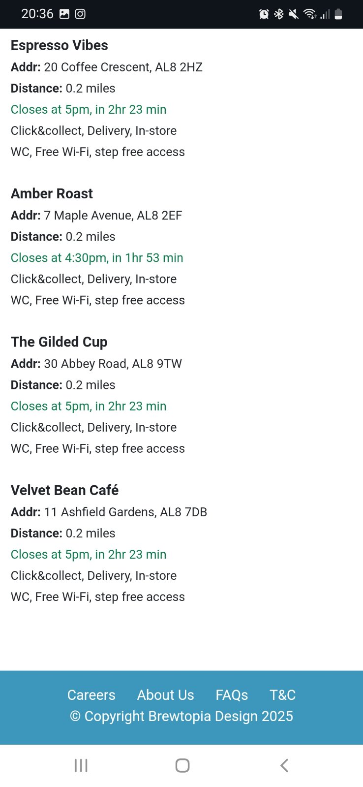
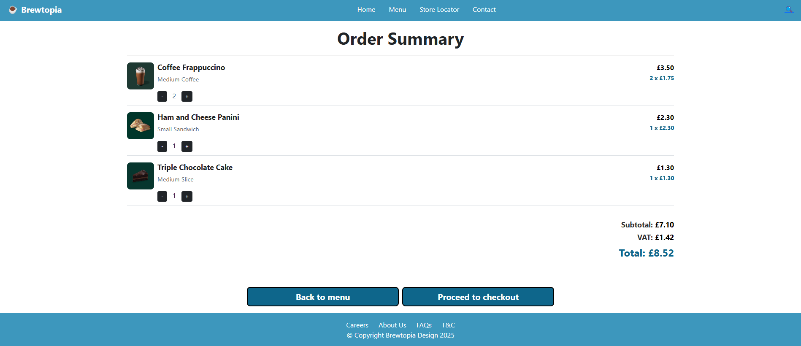

# UX-Assignment-3 Project

## Project Overview

This repository contains a collection of responsive HTML5 web pages which implement three Figma wireframes I've created for my UX assigment.
The web pages are meant to work seamlessly across dekstop, mobile and tablet devices of all sizes. 
The goal of this project is to learn how to transform wireframes into responsive front-end user interface using HTML5, CSS3 and frameworks.
In addition to that this project focuses on information architecture, uses GitHub for version control and GitHub Pages for deployment.
For this project I've used Bootstrap framework.

---

## What This Project Does

- Contains three responsive HTML5 pages which implement 3 user stories and index.html page for navigation.
- Contains shared styles.css file with custom styles shared across all three pages like colours, customised text inputs, buttons etc.
- Uses Bootstrap framework (https://getbootstrap.com/) to implement layout responsiveness.
- Uses Leaflet java script based open source map API (https://leafletjs.com/) to visually represent search results on the map and show the pins on it corresponding to the found coffeeshops. 
- Uses semantic HTML5 tags like header, footer, main, article, section in order to enhance accessibility and make the pages ready for search engine optimisation.

---

## External Dependencies

There are two large external dependencies for this project listed below:
1. Bootstrap open source framework (https://getbootstrap.com/) to implement responsive front-end user interface on all four pages to ensure the front-end user interface renders well on desktop, tablet and mobile devices.
2. Leaflet open source map (https://leafletjs.com/) to integrate interactive map onto the store_locator.html page and visually show the search results on it.

---

## User Stories

The three pages I've created implement three user stories I've come up with in the UX Assignment 2 and are meant to offer users three valuable features on the coffeeshop website such as:
- store locator page;
- order summary page;
- order delivery options page.

### User Story 1: Store locator page

- As a: **mobile office worker**
- So that: I could save time on grabbing coffee from a coffeshop at lunch time
- I need: website to allow me to locate nearest coffeshop I could make my online order from

**Acceptance criteria:**
- User has access to the store locator on the website
- Use can enter post code into a text box and get the list of 4 nearest coffee shops to his post code
- There has to be a list of 4 nearest coffee shops to be shown to a user with their names, addresses,  distance to them, closing time and delivery options.
- All 4 nearest coffee shops have to be shown on the google maps for user to be able to understand where they are located and provide visual guidance how to find them.
- The text content on the page is accessible with big enough text and in high contrast to help visually impaired users.

### User Story 2: Delivery options page

- As a: **mobile office worker**
- So that: I could save time on grabbing coffee from a coffeshop at lunch time by making online order and get it delivered to me.
- I need: website to allow me to pick the delivery option and use it for my online order.

**Acceptance criteria:**
- User can select the delivery service from Deliveroo, UberEats, JustEat.
- Use can enter details for the delivery service such as first name, last name, delivery address, contact email/phone number.
- User can select a time slot convenient for them for the order to be delivered.
- User can enter optional comments for the delivery service e.g. "The bell does not work, please knock on the door."
- User must be able to confirm order by clicking the button "Order Now".

### User Story 3: Order summary page

- As a: **student**
- So that: I could save time in the morning when picking up my coffee from the coffeeshop by making order on the bus through the app
- I need: App and website to allow me to view my online order to check its content and everything looks right and then proceed to checkout

**Acceptance criteria:**
- User can see the items they chose in the menu and the price for each item and quantity.
- Use can see the subtotal of all items a user added to the order, VAT amount for the order and the total amount with VAT to be paid during the checkout.
- User can click 'Proceed to checkout' button to get to the checkout page to enter payment information.
- User can click 'Back to menu' button to get back to the menu page where additional items can be chosen to be added to the order.
- Text should be accessible as the user has dyslexia.

---

## Development Process

### Wireframes

The feedback from Assignment 2 Group Project was this:
"Wireframes design are clear completed for both desktop and mobile view port. Showing clear sample content. Some evaluation of designs based on usability and accessibility."

Based on the above feedback no major changes were done to the Figma wireframes I've created. 

However, for the responsive front-end user interface I've decided to further enhance usability and accessibility by introducing the following things:
- Buttons highlightting so that when a user hovers mouse over a button on a page it changes its colour this way visually informs a user a button is selected and can be clicked;
- Add placeholder text to the text inputs to guide a user what input is expected in each text box input field;
- Add highlighting to a delivery partner image when mouse mouse hovers over it to visually guide user which option is selected;
- Add contrast border and shadow to text input fields and buttons to make them visually stand out for users;
- When mouse hovers over a hyperlink in the header menu or footer menu the text becomes underlined to visually inform user which hyperlink is selected.

#### Store Locator Page Wireframe Desktop Version

#### Store Locator Page Wireframe Mobile Version

#### Order Summary Page Wireframe Desktop Version

#### Order Summary Page Wireframe Mobile Version

#### Delivery Option Page Wireframe Desktop Version

#### Delivery Option Page Wireframe Mobile Version

### Information Architecture

In order to facilitate easy access to different pages index.html simple page has been added to implement main navigation menu to navigate between all three responsive pages.

To ensure a structured and logical layout and to enhance user experience and usability each of the three responsive page and index.html have the same logical layout:
- header section with the coffeeshop name Brewtopia and navigation bar with hyperlinks to other pages of the website e.g. Home leads to index.html and Store Locator leads to the corresponding responsive page.
- main/middle section of the page with the responsive content of the corresponding page;
- footer section with another set of hyperlinks and also copyright info which is usually being added onto websites;
- the main section of the order summary page is organised with top down information flow in mind so that a user goes from top through each order item and for each order item from left to right and then comes down to the order totals and finally to the bottom where two Back to Menu and Proceed To Checkout buttons are present. Same top down flow is implemented for mobile version;
- the main section of the delivery options page is also organised with top down information flow where a user starts at the top by selecting one of three delivery partners and then continues down by filling in delivery details and finally coming to the bottom with the order total amount being shown to recap it to a user and Order Now button being present. Same flow is followed for the mobile version;
- the main section of the store locator page has search text input on top to allow a user to enter search query and then list of found coffeeshops on the left side and the main element being the map with found coffeeshops on the right and it takes the 80% of the screen size. For the mobile version after the search text input the map goes first as it has better accessibility
 for users comparing to textual output and then list of found coffeeshops goes.

### Project Design Considerations

When designing the project I've considered the following things:
- all file names and folder names must be in lower case. That's because when they are being deployed likely it is going to be a Linux server so file names and folder names are case sensitive;
- all the files in the project have to be organised into a logical folder structure.

### Code Organisation

The code is meant to be clean, readable, and maintainable with meaningful variable and function names and I am aiming to achieve this by:
- variables are used in CSS for colours so that if I need to change a color value say for a header I change one variable and changes are applied everywhere where this variable is used;
- UI elements have meaningful names;
- every attempt is made to make code shared across pages like for example same code is used on all pages for the header and the footer blocks;
- single styles.css file is used to contain all of the CSS code which can be reused on all pages and maintained in a single place.

Follow consistent code formatting and style guidelines:
- indentations are used in HTML to clearly isolate blocks of code into a hierarchy and enable quick navigation throughout the code;
- empty lines are used in the files to additionally separate logical blocks of code e.g. main section from header and footer;

Use comments and documentation to explain complex logic and provide context:
- HTML code is documented with comments throughout providing the context what is being rendered in each logical block of code;
- styles.css file with CSS code has comments throughout.

### Folder Structure 

<pre><code>
├── index.html
├── store_locator.html
├── delivery_options.html
├── order_summary.html
├── README.md
├── css/
│   └── styles.css
├── docs/
│    ├── wireframes/
│    │   ├── store_locator_wireframe_desktop.png
│    │   ├── store_locator_wireframe_mobile.png
│    │   ├── delivery_option_wireframe_desktop.png
│    │   ├── delivery_option_wireframe_mobile.png
│    │   ├── order_summary_wireframe_desktop.png
│    │   └── order_summary_wireframe_mobile.png
│    └── screenshots/
│        ├── index_final_desktop.png
│        ├── index_final_tablet.jpg
│        ├── index_final_mobile.jpg
│        ├── store_locator_final_desktop.png
│        ├── store_locator_final_tablet_1.jpg
│        ├── store_locator_final_tablet_2.jpg
│        ├── store_locator_final_mobile_1.jpg
│        ├── store_locator_final_mobile_2.jpg
│        ├── delivery_option_final_desktop.png
│        ├── delivery_option_final_tablet.png
│        ├── delivery_option_final_mobile_1.jpg
│        ├── delivery_option_final_mobile_2.jpg
│        ├── order_summary_final_desktop.png
│        ├── order_summary_final_tablet.jpg
│        ├── order_summary_final_mobile_1.jpg
│        └── order_summary_final_mobile_2.jpg
└── assets/
    └── images/
         ├── map.png
         ├── uber_eats.png
         ├── deliveroo.png
         ├── just_eat.png
         ├── coffee.png
         ├── sandwich.png
         └── cake.png
</code></pre>

### Finished Product

In this section the screenshots of the finished product are presented for the desktop, tablet and mobile devices to demonstrate the rsponsive design I've created in action.
These results have been produced on the back of the manual testing procedures I've executed and detailed in the separate section below.

#### Index Page Finished Product Desktop Version

#### Index Page Finished Product Tablet Version

#### Index Page Finished Product Mobile Version

#### Store Locator Page Finished Product Desktop Version

#### Store Locator Page Finished Product Tablet Version

#### Store Locator Page Finished Product Mobile Version

#### Order Summary Page Finished Product Desktop Version

#### Order Summary Page Finished Product Tablet Version

#### Order Summary Page Finished Product Mobile Version

#### Delivery Option Page Finished Product Desktop Version

#### Delivery Option Page Finished Product Tablet Version

#### Delivery Option Page Finished Product Mobile Version

## Manual Testing Procedures

### Tests Conducted

**Responsiveness tested for each user story on:**
- Chrome browser on Desktop (Windows 11), Samsung M31 (Android), Google Pixel Tablet (Android)
- Microsoft Edge browser on desktop (Windows 11)
- Firefox browser on Desktop (Windows 11)

**Accessibility checks for each user story performed:**
- Keyboard navigation tested for each responsive page so that a user can navigate between UI controls using Keyboard.
- Alt attributes on images are tested to be present and shown when images are not loaded.

**Functional tests for each user story performed:**
- Navigation links tested to navigate from index.html to three pages, Home menu item to navigate to index.html, search icon in the top right corner to naviagate to store_locator.html page.
- Buttons interactivity tested to ensure when mouse is hovered a button changes its colour to visually guide user it is selected and can be clicked.
- Map interactivity tested when a coffeeshop is selected on the map its name is shown.

### User Story 1 Acceptance Criteria Validation

**Acceptance criteria:**
- Fulfilled: User has access to the store locator on the website
- Fulfilled: Use can enter post code into a text box and get the list of 4 nearest coffee shops to his post code
- Fulfilled: There has to be a list of 4 nearest coffee shops to be shown to a user with their names, addresses,  distance to them, closing time and delivery options.
- Fulfilled: All 4 nearest coffee shops have to be shown on the google maps for user to be able to understand where they are located and provide visual guidance how to find them.
- Fulfilled: The text content on the page is accessible with big enough text and in high contrast to help visually impaired users.

### User Story 2 Acceptance Criteria Validation

**Acceptance criteria:**
- Fulfilled: User can select the delivery service from Deliveroo, UberEats, JustEat.
- Fulfilled: Use can enter details for the delivery service such as first name, last name, delivery address, contact email/phone number.
- Fulfilled: User can select a time slot convenient for them for the order to be delivered.
- Fulfilled: User can enter optional comments for the delivery service e.g. "The bell does not work, please knock on the door."
- Fulfilled: User must be able to confirm order by clicking the button "Order Now".

### User Story 3 Acceptance Criteria Validation

**Acceptance criteria:**
- Fulfilled: User can see the items they chose in the menu and the price for each item and quantity.
- Fulfilled: Use can see the subtotal of all items a user added to the order, VAT amount for the order and the total amount with VAT to be paid during the checkout.
- Fulfilled: User can click 'Proceed to checkout' button to get to the checkout page to enter payment information.
- Fulfilled: User can click 'Back to menu' button to get back to the menu page where additional items can be chosen to be added to the order.
- Fulfilled: Text should be accessible as the user has dyslexia.

### Bugs Found and Fixed

The following major bugs have been found and fixed during the development and final testing stages of the project.

| Bug | Status | Fix |
|:-----|:------------|:------------|
| 'Back to Menu' and 'Proceed to Checkout' buttons have different order on desktop and on mobile | ✅ Fixed | Special Bootstrap's dynamic ordering elements have been used to ensure on desktop 'Back to Menu' shown on the left and 'Proceed to Checkout' shwon on the right and on mobile 'Proceed to Checkout' shown first and 'Back to Menu' shown second. |
| Images for the delivery partners not displayed | ✅ Fixed | Incorrect files names specified in the img HTML tag. After file names have been corrected images became shown as expected. |
| Hyperlinks in the footer didn't have underline when mouse is hovered on them | ✅ Fixed | CSS style for the footer's hyperlinks was corrected to ensure underline is enabled when mouse is howevered. |
| Interactive map was shown below the list of 4 found coffeeshops and not to the right from it | ✅ Fixed | 1. Bootstrap's ratio element was used to adjust map's dimensions 2. Bootstrap's 'col-md-9' 'order-1' 'order-md-2' were used to enforce ordering when the map is rendered. |
| Delivery partner images were of different sizes so not visually appealing | ✅ Fixed | Dimensions of all 3 images were aligned and also rounding of the corners has been added in CSS to make them look visually appealing. |

## Automated Testing & Validation

### HTML Validation

All HTML pages validated using W3C HTML Validator available at: https://validator.w3.org/nu/

**Common issues addressed:**
- "Trailing slash on void elements has no effect and interacts badly with unquoted attribute values." resolved by removing trailing slash on void elements.

### CSS Validation

Validated using W3C CSS Validator available at: https://jigsaw.w3.org/css-validator/

I've inserted the link to my styles.css file at: https://alex-oma.github.io/UX-Assignment-3/css/styles.css

Result: 
W3C CSS Validator results for https://alex-oma.github.io/UX-Assignment-3/css/styles.css (CSS level 3 + SVG)
Congratulations! No Error Found.

### JavaScript Validation

The java script code present in the store_locator.html page to render the map was validated using https://jshint.com/ 

Result:
No errors found.

## Setup and Running Instructions

1. **Clone the Repository**
   bash
   git clone https://github.com/Alex-Oma/UX-Assignment-3.git
   cd UX-Assignment-3
   
   or download the code as a zip archive using the below link and unzip it after download:
   https://github.com/Alex-Oma/UX-Assignment-3/archive/refs/heads/main.zip
  
2. **Running the project**
	In the 'UX-Assignment-3' folder run index.html file and it opens in your browser.
	Navigate to three responsive pages.
	
	
## Deployment

The project has been deployed using GitHub Pages and is accessible under this URL:
https://alex-oma.github.io/UX-Assignment-3/index.html

If you would like to deploy to GitHub Pages you may follow the steps detailed on this page:
https://docs.github.com/en/pages/quickstart

